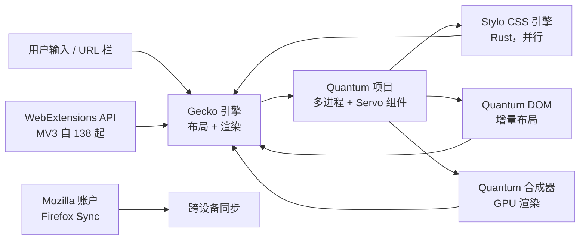

# Firefox — 现代独立网页浏览器

**Firefox** 是由 **Mozilla 基金会** 与贡献者构建的现代网页浏览器，
使用 **Gecko** 渲染引擎。它是 **唯一** 一个不基于 Google Blink /
Chromium 的主流浏览器引擎。

采用 **Mozilla Public License 2.0 (MPL-2.0)** 协议，Firefox 提供
**Windows、macOS、Linux、BSD、Android 和 iOS** 平台支持，默认开启强
隐私特性 —— 增强跟踪保护、总 Cookie 保护、容器标签页 —— 以及持续
发展的 WebExtensions API。

> **TL;DR。** Firefox 是经典的独立浏览器选择。用 `x env use firefox`
> 安装，或从 <https://www.mozilla.org/firefox/> 下载。强隐私默认，
> 适用于所有桌面 + 移动平台，使用你能控制的引擎。

## Firefox 为什么存在？

两个原因。

1. **引擎独立性。** 2026 年，有三个引擎在渲染网页：Gecko（Firefox）、
   WebKit（Safari + 所有 iOS 浏览器）、Blink（Chrome、Edge、Brave、
   Arc、Vivaldi、Opera）。仅 Blink 就占据约 76% 桌面份额。Mozilla
   的使命是让一个独立引擎保持健康，使网页的底层基础设施不取决于
   单一公司。
2. **默认隐私。** Firefox 默认开启增强跟踪保护、总 Cookie 保护和
   容器标签页。大多数 Chromium 系浏览器需要手动开启类似功能（或
   安装扩展）。

## 架构



两个关键子项目：

- **Quantum**（2017 年起）—— 多进程架构、并行 CSS 渲染、GPU 合成。
  让 Firefox 重回有竞争力的性能。
- **Project Fission**（2020 年起，2024 年默认）—— 按源的站点隔离，
  对抗 Spectre 类攻击的纵深防御。

## 与相似工具的对比

| 工具 | 引擎 | 同步 | 隐私 | 最佳场景 |
| --- | --- | --- | --- | --- |
| **Firefox** | Gecko | Firefox Sync（Mozilla 账户） | 默认强 | 独立引擎、隐私 |
| **[Chrome](https://www.google.com/chrome/)** | Blink | Google 账户 | Privacy Sandbox | 兼容性、生态 |
| **[Safari](https://www.apple.com/safari/)** | WebKit | iCloud | 默认强 | Apple 用户、电池 |
| **[Brave](https://brave.com/)** | Blink | Brave Sync | Chromium 系最强 | 广告拦截、Web3 |
| **[LibreWolf](https://librewolf.net/)** | Gecko | 无（无 Mozilla 账户） | Firefox 系最强 | Firefox 但无遥测 |
| **[Tor Browser](https://www.torproject.org/)** | Gecko（补丁） | 无 | Tor 网络 | 匿名 |

## 何时用 vs 何时不用

**用 Firefox 的场景：**

- 你想要独立引擎（非 Blink，非 WebKit）。
- 默认隐私比生态锁定更重要。
- 你想要容器标签页（每个 Cookie 罐的独立身份）。
- 你想要完整的 WebExtensions API，同时支持 MV2 + MV3。
- 你想要跨设备的 Firefox Sync。

**不用 Firefox 的场景：**

- 你深度依赖 Google 生态（Workspace、Drive）。Chrome 集成更好。
- 你想要 Chromium 扩展兼容性。Firefox 支持大多数 Chrome 扩展，
  但 MV3 一些细节有差异。
- 你想要 Apple 设备端 AI。Safari 优先获得 Apple Intelligence 功能。

## 如何安装

**x-cmd（一行命令）：**

```bash
x env use firefox
```

**包管理器：**

```bash
# macOS（Homebrew）
brew install --cask firefox

# Arch Linux
sudo pacman -S firefox

# Debian / Ubuntu
sudo apt install firefox

# Fedora
sudo dnf install firefox

# openSUSE
sudo zypper install firefox

# FreeBSD
pkg install firefox
```

**预构建二进制：** 从 <https://www.mozilla.org/firefox/> 下载。
Windows（.exe 安装包或 MSI）、macOS（.dmg）、Linux（tarball）。

**移动：** Firefox for Android（Play Store、F-Droid），
Firefox for iOS（App Store —— 注意：由于 Apple 政策，iOS 上
用 WebKit）。

## 配置

Firefox 通过 GUI（`about:preferences`）或 `about:config`（高级）配置。
没有标准的 "firefox.toml" —— 配置项在 profile 目录下的 `prefs.js` /
`user.js`。

**Profile 位置：**

- Linux：`~/.mozilla/firefox/<profile>/`
- macOS：`~/Library/Application Support/Firefox/Profiles/<profile>/`
- Windows：`%APPDATA%\Mozilla\Firefox\Profiles\<profile>\`

### `user.js` 示例

```js
// 启用严格跟踪保护
user_pref("privacy.trackingprotection.enabled", true);
user_pref("privacy.trackingprotection.fingerprinting.enabled", true);
user_pref("privacy.trackingprotection.cryptomining.enabled", true);

// 关闭遥测
user_pref("toolkit.telemetryenabled", false);
user_pref("toolkit.telemetryunified", false);

// 启用 DNS over HTTPS
user_pref("network.trr.mode", 3);  // 3 = 严格，0 = 关，2 = 竞争
user_pref("network.trr.uri", "https://mozilla.cloudflare-dns.com/dns-query");

// 启用容器标签页
user_pref("privacy.userContext.enabled", true);
```

放进 `<profile>/user.js`。

## 隐私特性

| 特性 | 描述 | 默认开启？ |
| --- | --- | --- |
| **增强跟踪保护（ETP）** | 拦截跟踪器、指纹器、加密货币挖矿。三级：标准、严格、自定义。 | ✅ 标准 |
| **总 Cookie 保护** | Cookie 罐按站点分区；不通过 Cookie 跨站跟踪。 | ✅ |
| **容器标签页** | 用不同容器打开同一站点，Cookie 互相隔离。 | ⚠️ 推荐扩展 |
| **指纹保护** | 拦截指纹脚本。 | ✅（严格） |
| **DNS over HTTPS（DoH）** | 加密 DNS 解析。 | ⚠️ 许多地区默认关 |
| **SmartBlock** | 用占位脚本替换被拦截的跟踪器，不破坏页面。 | ✅ |
| **HTTPS-Only 模式** | 全程强制 HTTPS。 | ⚠️ 默认关 |
| **Firefox Relay** | 邮件别名服务。 | ⚠️ 扩展 |

## 系统要求

| 要求 | 细节 |
| --- | --- |
| **Windows** | Windows 10 或更新 |
| **macOS** | macOS 10.15（Catalina）或更新 |
| **Linux** | glibc 2.31+（大多数现代发行版） |
| **内存** | 典型会话约 500 MB 工作集 |
| **磁盘** | 约 300 MB 安装 + profile |

## 关键功能

| 功能 | 描述 |
| --- | --- |
| **标签页分组** | 把标签页组织到命名的组中。（2026 年 8 月：AI 辅助分组。） |
| **固定标签页** | 把常用标签页固定到左侧。 |
| **多账户容器** | 每个"容器"独立 Cookie —— 工作 / 个人 / 银行。 |
| **总 Cookie 保护** | Cookie 按第一方域分区。 |
| **画中画** | 把视频从页面弹出成悬浮窗口。 |
| **跟踪保护报告** | `about:protections` —— 查看每周拦截情况。 |
| **同步** | 标签页、历史、书签、登录信息、扩展 —— 跨设备。 |
| **阅读器视图** | 去除文章杂项。 |
| **截图** | 内置截图工具（捕捉 + 注释）。 |
| **翻译** | 通过 Bergamot 设备端翻译。 |

## 典型场景

- **注重隐私的浏览** —— 默认强；最有用的保护无需手动开启。
- **多账户工作流** —— 容器标签页让你同时登录多个 Google / GitHub 账户。
- **跨平台** —— Linux / Windows / macOS / Android / iOS —— 同一引擎、同一 UI、同一同步。
- **独立网页** —— 支持引擎多样性，让网页基础设施不变成单一公司的调用。
- **开发工具** —— 出色的内置开发工具；容器标签页 + 多账户容器是 Firefox 独有的。

## 优 / 劣 / 结论

| 维度 | 结论 |
| --- | --- |
| **优** | 唯一主流的独立引擎浏览器 |
| **优** | 默认开启强隐私保护 |
| **优** | 容器标签页 —— Firefox 独有 |
| **优** | WebExtensions API 同时支持 MV2 + MV3 |
| **优** | MPL-2.0 协议 |
| **劣** | 一些仅 Chromium 的网页应用可能有小问题 |
| **劣** | 在某些工作负载下内存占用略高于 Chrome |
| **劣** | 历史上有"慢"的名声（Quantum 已修复，但印象仍在） |
| **结论** | **推荐**给重视引擎独立性或隐私默认的任何人；**跳过**如果你深度锁定在 Google 生态。 |

## 需要记住的事

- **iOS 上 Firefox 用 WebKit。** Apple 政策要求。iOS 版 Firefox
  是相同的 UI + 同步，但通过 WebKit 渲染，不用 Gecko。
- **容器标签页需要扩展**（Multi-Account Containers）才好用。
  API 内置，但 UI 单独发布。
- **同步需要 Mozilla 账户。** 如果不想要 Mozilla 账户，就会失去
  同步；其他功能正常。
- **Mozilla 自带 Pocket 集成**（地址栏的"保存到 Pocket"按钮）。
  Pocket 归 Mozilla 所有。可以在 `about:preferences` 关闭。
- **Manifest V3 过渡：** Firefox 138（2026 年 8 月）终于在稳定版
  落地 MV3。大多数扩展开发者现在优先 MV3。

## 时间线

- **2002-09** —— Phoenix 0.1（前身）。
- **2004-02** —— Firefox 1.0 发布，承接 Mozilla Application Suite。
- **2008** —— Mozilla 基金会成立。
- **2017-11** —— Firefox Quantum（57）—— 多进程架构、通过 Stylo 的并行 CSS、GPU 合成。
- **2020-05** —— Project Fission 开始铺开。
- **2024** —— Project Fission 对所有用户默认；全量站点隔离。
- **2026-08** —— Firefox 138 —— MV3 稳定；AI 标签页分组；CSS speculative rules。

## 源码巡礼

Firefox 仓库在
[`mozilla-central`](https://hg.mozilla.org/mozilla-central/)，
一个 Mercurial 仓库。构建系统是 `mozbuild`；nightly / beta /
release 通道共享同一源码树。重要子项目：

- **Gecko** —— 布局 / 渲染引擎。
- **Stylo** —— 并行 CSS 引擎（Rust）。
- **Servo** —— 独立的 Rust 实验引擎，Stylo 来源。
- **NSS** —— 网络安全服务库（TLS、加密）。
- **SpiderMonkey** —— JavaScript 引擎。

本地构建：

```bash
hg clone https://hg.mozilla.org/mozilla-central/
cd mozilla-central
./mach bootstrap
./mach build
./mach run
```

注意：完整 Firefox 构建耗时数小时，需要较强机器。大多数贡献者
在小组件上工作，通过 Phabricator / Bugzilla 提交。

## 下一步？

- **快速开始** —— `x env use firefox`，然后访问 `about:preferences`
  确认跟踪保护设为标准或严格。
- **多账户容器** —— 安装扩展；创建工作 / 个人 / 银行容器。
- **同步** —— 用 Mozilla 账户登录同步标签页 / 书签 / 登录信息。
- **Firefox Relay** —— 可选的注册用邮件别名服务。

## 相关工具

- **容器标签页** —— Mozilla 的 Multi-Account Containers 扩展。
- **隐私** —— uBlock Origin（广告拦截）、Privacy Badger（EFF）。
- **同步** —— 通过 Mozilla 账户的 Firefox Sync（免费）。
- **邮件别名** —— Firefox Relay（免费层、$）。
- **翻译** —— Firefox Translate（通过 Bergamot 设备端）。

## 源码与官方资源

- **官网：** <https://www.mozilla.org/firefox/>
- **源码：** <https://hg.mozilla.org/mozilla-central/>
- **Bugzilla：** <https://bugzilla.mozilla.org/>
- **扩展：** <https://addons.mozilla.org/>
- **MDN：** <https://developer.mozilla.org/>
- **Firefox 发布说明：** <https://www.mozilla.org/en-US/firefox/releases/>
- **隐私：** <https://www.mozilla.org/privacy/firefox/>
- **路线图：** <https://wiki.mozilla.org/Firefox/Roadmap>