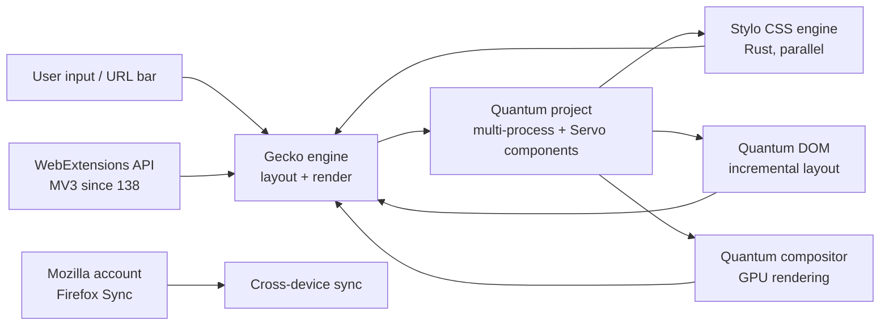

# Firefox — A Modern, Independent Web Browser

**Firefox** is a modern web browser built by the **Mozilla
Foundation** and contributors, using the **Gecko** rendering
engine. It is the **only** major web browser with a layout
engine fully independent of Google's Blink / Chromium.

Distributed under the **Mozilla Public License 2.0 (MPL-2.0)**,
Firefox ships on **Windows, macOS, Linux, BSD, Android, and iOS**,
with strong privacy features on by default — Enhanced Tracking
Protection, Total Cookie Protection, container tabs — and a
growing WebExtensions API.

> **TL;DR.** Firefox is the canonical independent-browser choice.
> Install with `x env use firefox`, or download from
> <https://www.mozilla.org/firefox/>. Strong privacy defaults,
> works on every desktop + mobile platform, and uses an engine
> you control.

## Why does Firefox exist?

Two reasons.

1. **Engine independence.** In 2026, three engines render the
   web: Gecko (Firefox), WebKit (Safari + all iOS browsers),
   and Blink (Chrome, Edge, Brave, Arc, Vivaldi, Opera). Blink
   alone holds ~76% of desktop share. Mozilla's mission is to
   keep an independent engine healthy so the web's substrate
   isn't a single company's call.
2. **Privacy by default.** Firefox ships Enhanced Tracking
   Protection, Total Cookie Protection, and container tabs on
   by default. Most Chromium-based browsers require opting in
   to similar features (or installing an extension).

## Architecture



Two key sub-projects:

- **Quantum** (since 2017) — multi-process architecture,
  parallel CSS rendering, GPU compositing. The project that
  brought Firefox back to competitive performance.
- **Project Fission** (since 2020, default in 2024) — site
  isolation per origin, defense in depth against Spectre-style
  attacks.

## How does it differ from similar tools?

| Tool | Engine | Sync | Privacy | Best for |
| --- | --- | --- | --- | --- |
| **Firefox** | Gecko | Firefox Sync (Mozilla account) | Strong default | Independent engine, privacy |
| **[Chrome](https://www.google.com/chrome/)** | Blink | Google account | Privacy Sandbox | Compatibility, ecosystem |
| **[Safari](https://www.apple.com/safari/)** | WebKit | iCloud | Strong default | Apple users, battery |
| **[Brave](https://brave.com/)** | Blink | Brave Sync | Strongest in Chromium | Ad blocking, Web3 |
| **[LibreWolf](https://librewolf.net/)** | Gecko | None (no Mozilla account) | Strongest in Firefox | Firefox without telemetry |
| **[Tor Browser](https://www.torproject.org/)** | Gecko (patched) | None | Tor network | Anonymity |

## When to use vs when NOT

**Use Firefox when:**

- You want an independent engine (not Blink, not WebKit).
- Privacy defaults matter more than ecosystem lock-in.
- You want container tabs (separate identity per cookie jar).
- You want full WebExtensions API with both MV2 + MV3 support.
- You want Firefox Sync across devices.

**Don't use Firefox when:**

- You depend on Google ecosystem tightly (Workspace, Drive).
  Chrome is the better integration.
- You want Chromium-based extension compatibility. Firefox
  supports most Chrome extensions but some MV3 specifics differ.
- You want Apple's on-device AI. Safari gets Apple's
  Intelligence features first.

## How to install

**x-cmd (one command):**

```bash
x env use firefox
```

**Package managers:**

```bash
# macOS (Homebrew)
brew install --cask firefox

# Arch Linux
sudo pacman -S firefox

# Debian / Ubuntu
sudo apt install firefox

# Fedora
sudo dnf install firefox

# openSUSE
sudo zypper install firefox

# FreeBSD
pkg install firefox
```

**Pre-built binaries:** Download from
<https://www.mozilla.org/firefox/>. Windows (.exe installer
or MSI), macOS (.dmg), Linux (tarball).

**Mobile:** Firefox for Android (Play Store, F-Droid),
Firefox for iOS (App Store — note: uses WebKit on iOS due
to Apple policy).

## Configuration

Firefox is configured through the GUI (`about:preferences`)
or `about:config` for advanced settings. There is no
canonical "firefox.toml" — settings live in `prefs.js` /
`user.js` under the profile directory.

**Profile locations:**

- Linux: `~/.mozilla/firefox/<profile>/`
- macOS: `~/Library/Application Support/Firefox/Profiles/<profile>/`
- Windows: `%APPDATA%\Mozilla\Firefox\Profiles\<profile>\`

### Sample `user.js`

```js
// Enable strict tracking protection
user_pref("privacy.trackingprotection.enabled", true);
user_pref("privacy.trackingprotection.fingerprinting.enabled", true);
user_pref("privacy.trackingprotection.cryptomining.enabled", true);

// Disable telemetry
user_pref("toolkit.telemetryenabled", false);
user_pref("toolkit.telemetryunified", false);

// Enable DNS over HTTPS
user_pref("network.trr.mode", 3);  // 3 = strict, 0 = off, 2 = race
user_pref("network.trr.uri", "https://mozilla.cloudflare-dns.com/dns-query");

// Enable container tabs
user_pref("privacy.userContext.enabled", true);
```

Drop into `<profile>/user.js`.

## Privacy features

| Feature | Description | On by default? |
| --- | --- | --- |
| **Enhanced Tracking Protection (ETP)** | Blocks trackers, fingerprinters, cryptominers. Three levels: Standard, Strict, Custom. | ✅ Standard |
| **Total Cookie Protection** | Cookie jars partitioned per site; no cross-site tracking via cookies. | ✅ |
| **Container tabs** | Open the same site in different containers with separate cookies. | ⚠️ Add-on recommended |
| **Fingerprint protection** | Blocks fingerprinting scripts. | ✅ (Strict) |
| **DNS over HTTPS (DoH)** | Encrypted DNS resolution. | ⚠️ Off by default in many regions |
| **SmartBlock** | Replaces blocked trackers with stand-in scripts that don't break pages. | ✅ |
| **HTTPS-Only Mode** | Force HTTPS everywhere. | ⚠️ Off by default |
| **Firefox Relay** | Email alias service. | ⚠️ Add-on |

## System requirements

| Requirement | Detail |
| --- | --- |
| **Windows** | Windows 10 or later |
| **macOS** | macOS 10.15 (Catalina) or later |
| **Linux** | glibc 2.31+ (most modern distros) |
| **RAM** | ~500 MB working set for a typical session |
| **Disk** | ~300 MB install + profile |

## Key features

| Feature | Description |
| --- | --- |
| **Tab Groups** | Organize tabs into named groups. (Aug 2026: AI-assisted grouping.) |
| **Pinned Tabs** | Pin frequently-used tabs to the left edge. |
| **Multi-Account Containers** | Separate cookies per "container" — work / personal / banking. |
| **Total Cookie Protection** | Cookies partitioned per first-party domain. |
| **Picture-in-Picture** | Pop video out of the page into a floating window. |
| **Tracking Protection Report** | `about:protections` — see what's blocked per week. |
| **Sync** | Tabs, history, bookmarks, logins, add-ons — across devices. |
| **Reader View** | Strip clutter from articles. |
| **Screenshots** | Built-in screenshot tool (capture + annotate). |
| **Translations** | On-device translation via Bergamot. |

## Typical use cases

- **Privacy-conscious browsing** — Strong defaults; no
  opt-in required for the most useful protections.
- **Multi-account workflows** — Container tabs let you stay
  signed in to multiple Google / GitHub accounts at once.
- **Cross-platform** — Linux / Windows / macOS / Android /
  iOS — same engine, same UI, same sync.
- **Independent web** — Supporting engine diversity so the
  web's substrate doesn't become a single company's call.
- **Developer tools** — Excellent built-in dev tools;
  Container Tabs + Multi-Account Containers are unique to
  Firefox.

## Pro / Con / Verdict

| Dimension | Verdict |
| --- | --- |
| **Pro** | Only major independent-engine browser |
| **Pro** | Strong privacy defaults on by default |
| **Pro** | Container tabs — unique to Firefox |
| **Pro** | WebExtensions API with both MV2 + MV3 |
| **Pro** | MPL-2.0 license |
| **Con** | Some Chromium-only web apps may have minor issues |
| **Con** | Slightly higher memory use than Chrome in some workloads |
| **Con** | Historical reputation for being slow (resolved with Quantum, but lingering perception) |
| **Verdict** | **Recommended** for anyone who values engine independence or privacy defaults; **skip** if you're tightly locked into Google's ecosystem. |

## Things to keep in mind

- **On iOS, Firefox uses WebKit.** Apple policy requires it.
  Firefox for iOS is the same UI + sync but renders via
  WebKit, not Gecko.
- **Container tabs need an add-on** (Multi-Account Containers)
  to be useful. The API is built in, but the UI ships
  separately.
- **Sync requires a Mozilla account.** If you don't want a
  Mozilla account, you lose sync; everything else works
  fine.
- **Mozilla ships Pocket integration** (a "Save to Pocket"
  button in the address bar). Pocket is owned by Mozilla.
  You can disable it via `about:preferences`.
- **Manifest V3 transition:** Firefox 138 (Aug 2026) finally
  lands MV3 stable. Most extension developers are now MV3-
  first.

## Timeline

- **2002-09** — Phoenix 0.1 (precursor).
- **2004-02** — Firefox 1.0 released as the successor to the
  Mozilla Application Suite.
- **2008** — Mozilla Foundation formed.
- **2017-11** — Firefox Quantum (57) — multi-process
  architecture, parallel CSS via Stylo, GPU compositing.
- **2020-05** — Project Fission begins rollout.
- **2024** — Project Fission default for all users; Site
  Isolation everywhere.
- **2026-08** — Firefox 138 — Manifest V3 stable; AI Tab
  Groups; CSS speculative rules.

## Source-code tour

Firefox lives in
[`mozilla-central`](https://hg.mozilla.org/mozilla-central/),
a Mercurial repository. The build system is `mozbuild`;
nightly / beta / release channels share the same source tree.
Major sub-projects:

- **Gecko** — the layout / rendering engine.
- **Stylo** — the parallel CSS engine (Rust).
- **Servo** — a separate Rust-based experimental engine from
  which Stylo was derived.
- **NSS** — the network security services library (TLS,
  crypto).
- **SpiderMonkey** — the JavaScript engine.

To build locally:

```bash
hg clone https://hg.mozilla.org/mozilla-central/
cd mozilla-central
./mach bootstrap
./mach build
./mach run
```

Note: a full Firefox build takes hours and needs a beefy
machine. Most contributors work on smaller components and
land changes via Phabricator / Bugzilla.

## What next?

- **Quick start** — `x env use firefox`, then visit
  `about:preferences` to verify tracking protection is set
  to Standard or Strict.
- **Multi-Account Containers** — install the add-on; create
  Work / Personal / Banking containers.
- **Sync** — sign in with a Mozilla account to sync tabs /
  bookmarks / logins.
- **Firefox Relay** — optional email alias service for
  signups.

## Related Tools

- **Container tabs** — Multi-Account Containers add-on by
  Mozilla.
- **Privacy** — uBlock Origin (ad blocker), Privacy Badger
  (EFF).
- **Sync** — Firefox Sync via Mozilla account (free).
- **Email aliases** — Firefox Relay (free tier, $).
- **Translate** — Firefox Translate (on-device via Bergamot).

## Source & Official Resources

- **Website:** <https://www.mozilla.org/firefox/>
- **Source:** <https://hg.mozilla.org/mozilla-central/>
- **Bugzilla:** <https://bugzilla.mozilla.org/>
- **Add-ons:** <https://addons.mozilla.org/>
- **MDN:** <https://developer.mozilla.org/>
- **Firefox release notes:** <https://www.mozilla.org/en-US/firefox/releases/>
- **Privacy:** <https://www.mozilla.org/privacy/firefox/>
- **Roadmap:** <https://wiki.mozilla.org/Firefox/Roadmap>