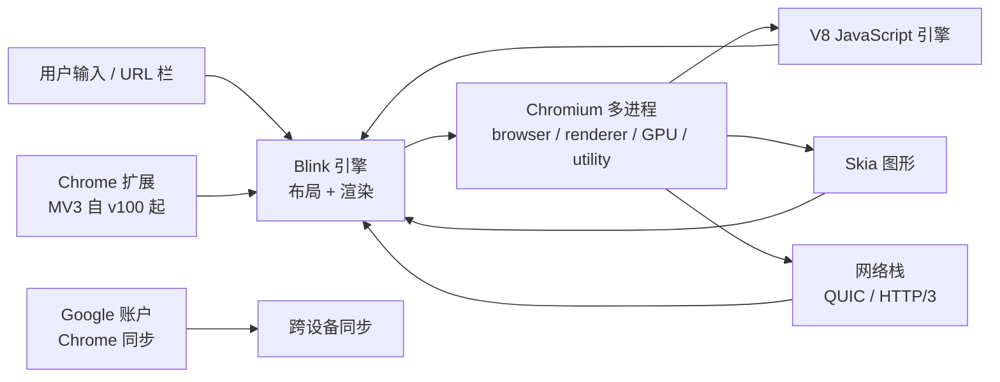

# Chrome — 现代跨平台网页浏览器

**Chrome** 是 Google 的网页浏览器，基于 **Blink** 渲染引擎。Chrome
作为免费下载提供，覆盖 **Windows、macOS、Linux、Android、iOS**，
是 2026 年网页兼容性的**事实标准**。

Chrome 是开源 **Chromium** 项目的上游。大多数"基于 Chromium 的
浏览器"（Edge、Brave、Arc、Vivaldi、Opera……）在相同的 Blink + V8
引擎上套一层薄的 UI / 功能层。Chrome 与"消费者版 Chromium"之间的
区别主要在品牌与 Google 专有服务（同步、翻译、安全浏览）。

> **TL;DR。** Chrome 是经典的"兼容性 + 生态"浏览器。用
> `x env use google-chrome` 安装，或从 google.com/chrome 下载。
> Blink 引擎；Gemini Nano 端侧 LLM（Pro 用户）；Privacy Sandbox 取代
> 第三方 Cookie。

## Chrome 为什么存在？

两个原因。

1. **网页兼容性。** 网页事实参考引擎。如果你建一个网站在 Chrome
   上能跑，几乎到处都能跑。
2. **Google 生态集成。** Google Search、Gmail、Drive、Workspace、
   YouTube、Photos、Calendar——都与 Chrome 的同步、密码管理器、翻译
   服务深度集成。

## 架构



主要组件：

- **Blink** —— 布局 / 渲染引擎（2013 年从 WebKit fork）。
- **V8** —— JavaScript 引擎；首发 JIT 编译、sparkplug，如今支持
  WebAssembly + WebGPU。
- **Chromium 多进程** —— browser / renderer / GPU / utility / 扩展
  进程；2018 年起按源站点隔离。
- **Skia** —— 二维图形库。
- **网络栈** —— 支持 HTTP/3、QUIC、TLS 1.3。

## 与相似工具的对比

| 工具 | 引擎 | 同步 | 隐私 | 最佳场景 |
| --- | --- | --- | --- | --- |
| **Chrome** | Blink | Google 账户 | Privacy Sandbox | 兼容性、生态、同步 |
| **[Firefox](https://www.mozilla.org/firefox/)** | Gecko | Firefox Sync（Mozilla） | ETP、总 Cookie 保护 | 独立引擎、隐私 |
| **[Safari](https://www.apple.com/safari/)** | WebKit | iCloud | 强（ITP） | Apple 用户、电池 |
| **[Brave](https://brave.com/)** | Blink | Brave Sync | Chromium 系最强 | 隐私、广告拦截、Web3 |
| **[Edge](https://www.microsoft.com/edge)** | Blink | Microsoft 账户 | 跟踪防护 | Microsoft 用户、工作 / 学校 |
| **[Arc](https://arc.net/)** | Blink | Arc 账户 | 一般 | 重度用户、多空间 |

## 何时用 vs 何时不用

**用 Chrome 的场景：**

- 你依赖 Google 生态（Workspace、Drive、Gmail、YouTube）。
- 你想要最广泛的网页兼容性。
- 你想要 Chrome 同步（密码、历史、书签、扩展）跨设备。
- 你想要 Gemini Nano 端侧 LLM（Pro 订阅）。

**不用 Chrome 的场景：**

- 引擎独立性很重要（用 Firefox）。
- 你想要最强隐私默认（用 Brave）。
- 你想要 Apple 原生体验（用 Safari）。
- 你想要无 Google 服务的 Chromium（用 Chromium 本身，或 Brave /
  Vivaldi / Arc）。

## 如何安装

**x-cmd（一行命令）：**

```bash
x env use google-chrome
```

**包管理器：**

```bash
# macOS（Homebrew）
brew install --cask google-chrome

# Debian / Ubuntu
wget https://dl.google.com/linux/direct/google-chrome-stable_current_amd64.deb
sudo dpkg -i google-chrome-stable_current_amd64.deb

# Fedora / RHEL
sudo dnf install fedora-workstation-repositories
sudo dnf install google-chrome-stable

# Arch Linux
yay -S google-chrome

# Android
# 从 Play Store 下载

# iOS
# 从 App Store 下载（注意：底层用 WebKit）
```

**预构建二进制：** 从 <https://www.google.com/chrome/> 下载。
Windows（.exe 安装包）、macOS（.dmg）、Linux（.deb）。

**开源替代：** **Chromium** 本身是上游开源项目。通过你的发行版
包管理器安装（`chromium`、`chromium-browser`）。注意：Chromium 不
附带 Google 专有服务（翻译、安全浏览、Widevine DRM、同步）。

## 配置

Chrome 通过 GUI（`chrome://settings`）或 `chrome://flags`（高级 /
实验）配置。

### 常用的 chrome:// 页面

| URL | 用途 |
| --- | --- |
| `chrome://settings` | 主设置 |
| `chrome://flags` | 实验功能 |
| `chrome://components` | 内部组件（Widevine 等） |
| `chrome://gpu` | GPU 加速状态 |
| `chrome://extensions` | 已安装扩展 |
| `chrome://net-export` | 网络抓包 |
| `chrome://discards` | 标签丢弃 / 内存节省 |
| `chrome://password-manager` | 密码管理器 |
| `chrome://sync-internals` | 同步调试 |

### Chrome 的策略驱动企业配置

对于托管部署，Chrome 从
`~/.config/google-chrome/policies/managed/`（Linux）或对应 Windows /
macOS 路径读取 JSON 策略文件。常见策略键：

- `ExtensionInstallBlocklist` —— 扩展黑名单。
- `URLBlocklist` —— URL 黑名单。
- `PasswordManagerEnabled` —— 切换密码管理器。
- `SafeBrowsingProtectionLevel` —— `standard` 或 `enhanced`。

## 隐私特性

| 特性 | 描述 | 默认？ |
| --- | --- | --- |
| **Privacy Sandbox** | 用 Topics / FLEDGE / Attribution API 取代第三方 Cookie。 | 渐进推出（2024–2026） |
| **Safe Browsing** | 钓鱼 / 恶意软件站点警告。 | ✅ Enhanced |
| **HTTPS-Only 模式** | 全程强制 HTTPS。 | ⚠️ 默认关 |
| **跟踪保护** | IP 保护、指纹保护。 | ⚠️ 渐进推出 |
| **Cookie** | 隐身模式下默认阻止第三方 Cookie。 | ⚠️ 普通模式下关（通过 Sandbox 渐进） |
| **同步加密** | 可选密码短语的端到端加密。 | ⚠️ 默认关 |

## 系统要求

| 要求 | 细节 |
| --- | --- |
| **Windows** | Windows 10 或更新（Chrome 138+ 在 Linux 上要求 glibc 2.28+） |
| **macOS** | macOS 11（Big Sur）或更新 |
| **Linux** | glibc 2.28+（较老发行版需要更新） |
| **内存** | 每个 Chrome 会话约 500 MB – 2 GB，取决于标签数 |
| **磁盘** | 约 300 MB 安装 + profile |

## 关键功能

| 功能 | 描述 |
| --- | --- |
| **标签页分组** | 把标签页组织到命名的组；可折叠。 |
| **固定标签页** | 把常用标签页固定到左侧。 |
| **阅读列表** | 保存文章以备后用。 |
| **翻译** | 内置翻译服务（云端）。 |
| **Lens** | 通过图像 / 相机做视觉搜索。 |
| **密码管理器** | 内置；跨设备同步。 |
| **Chrome 同步** | 书签、历史、密码、扩展、设置。 |
| **隐身模式** | 私密浏览（仅本地隐私）。 |
| **投屏** | 把标签 / 桌面投到 Chromecast / 智能电视。 |
| **DevTools** | 业界领先的网页开发工具。 |
| **AI：Gemini Nano** | 端侧 LLM（Pro 用户）——翻译、摘要、起草等。 |
| **Web Store** | 最大扩展生态（Chrome Web Store）。 |

## 典型场景

- **Google 生态** —— Workspace、Drive、Gmail、YouTube 都与 Chrome
  深度集成。
- **网页开发** —— DevTools 是金标准；庞大的扩展生态（React
  DevTools、Vue DevTools 等）。
- **跨设备同步** —— Chrome 同步在桌面 + Android 上是最顺畅的。
- **AI 助手（Gemini Nano）** —— Pro 订阅的端侧 LLM。
- **兼容性** —— 有疑问时，Chrome 是开发者测试的目标。

## 优 / 劣 / 结论

| 维度 | 结论 |
| --- | --- |
| **优** | 最广泛的网页兼容性 |
| **优** | 桌面 + Android 跨设备同步最佳 |
| **优** | 业界领先的 DevTools |
| **优** | 最大扩展生态 |
| **优** | Pro 用户的 Gemini Nano 端侧 AI |
| **劣** | 在 Privacy Sandbox 完成前仍有第三方 Cookie |
| **劣** | 在某些工作负载下内存占用高于 Firefox |
| **劣** | 隐私默认弱于 Brave / Safari / Firefox |
| **劣** | 引擎是 Blink——存在 Chromium 单一化问题 |
| **结论** | **推荐**如果你在 Google 生态或追求最大兼容性；**跳过**如果引擎独立性或强隐私默认是首要考虑。 |

## 需要记住的事

- **iOS 上 Chrome 用 WebKit。** Apple 政策要求。iOS 版 Chrome 有相同
  UI + 同步，但通过 WebKit 渲染。
- **Privacy Sandbox 是渐进的。** 第三方 Cookie 尚未完全阻止；topics
  / FLEDGE 在 2024–2026 铺开。
- **同步加密** 对新账户默认开启，但老账户可能没开。需要端到端时在
  `chrome://sync-internals` 设密码短语。
- **扩展需要 MV3。** Manifest V2 于 2024 年弃用。大多数扩展作者
  现在优先 MV3。
- **多 Google 账户。** 用 Chrome profile 分离 Google 账户（类似
  Firefox 容器）。
- **Chrome 变种。** `google-chrome-stable`、`-beta`、`-unstable`、
  `-canary`——可以并排安装用于测试。

## 时间线

- **2008-09** —— Chrome 1.0——首次公开发布。
- **2009** —— V8 JavaScript 引擎随 Chrome 发布。
- **2010** —— Chrome Web Store 上线。
- **2013** —— Blink 从 WebKit fork。
- **2018** —— 桌面默认按源站点隔离。
- **2020-12** —— Chrome 87——全面站点隔离。
- **2024** —— Privacy Sandbox 开始铺开。
- **2024** —— Manifest V3 弃用阶段 3。
- **2026-07** —— 当前的 138——所有标签页 GPU 合成；Pro 用户的 Gemini Nano 端侧 LLM。

## 源码巡礼

Chrome 的开源上游是 **Chromium**——
[`chromium/chromium`](https://chromium.googlesource.com/chromium/src/)。
主要组件：

- `third_party/blink/` —— Blink 渲染引擎。
- `v8/` —— V8 JavaScript 引擎。
- `chrome/browser/` —— Chrome 浏览器 UI（专有）。
- `chrome/common/` —— 通用 Chrome 工具。
- `net/` —— 网络栈（HTTP/3、QUIC、DNS）。
- `skia/` —— Skia 二维图形（与 Android 共用）。

构建：

```bash
git clone https://chromium.googlesource.com/chromium/src
cd src
./build/install-build-deps.sh   # 一次性设置
gclient sync
ninja -C out/Default chrome
./out/Default/chrome
```

完整 Chromium 构建耗时数小时，需要较强机器（建议 64 GB 内存）。
大多数贡献者在小组件上工作。

## 下一步？

- **快速开始** —— `x env use google-chrome`，然后访问
  `chrome://settings/syncSetup` 启用同步。
- **固定常用标签页** —— 右键标签页，"固定"。
- **标签页分组** —— 右键标签页，"添加到新组"。
- **密码管理器** —— `chrome://password-manager` 查看保存的凭据。
- **DevTools** —— `F12` 打开；`Ctrl+Shift+I` 分离。

## 相关工具

- [Chromium](https://www.chromium.org/) —— 开源上游。
- [Firefox](https://www.mozilla.org/firefox/) —— 独立引擎替代。
- [Brave](https://brave.com/) —— 带隐私默认的 Chromium。
- [Edge](https://www.microsoft.com/edge) —— Microsoft 的 Chromium 变体。
- [Arc](https://arc.net/) —— 重度用户的多空间 Chromium。

## 源码与官方资源

- **官网：** <https://www.google.com/chrome/>
- **源码（Chromium）：** <https://chromium.googlesource.com/chromium/src/>
- **Chrome Web Store：** <https://chromewebstore.google.com/>
- **DevTools 文档：** <https://developer.chrome.com/docs/devtools/>
- **Privacy Sandbox：** <https://privacysandbox.com/>
- **发布：** <https://chromereleases.googleblog.com/>
- **路线图 / issue：** <https://bugs.chromium.org/>