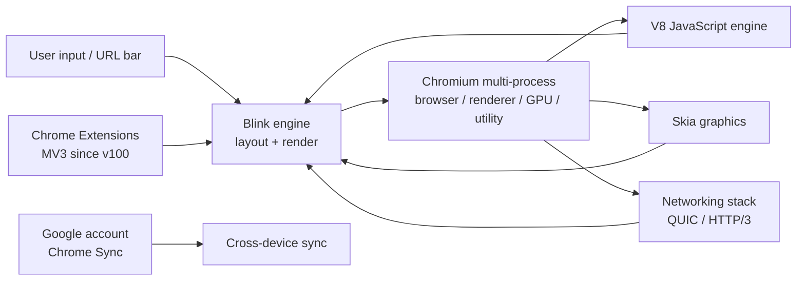

# Chrome — A Modern, Cross-Platform Web Browser

**Chrome** is Google's web browser, built on the **Blink**
rendering engine. Distributed as a free download, Chrome ships
on **Windows, macOS, Linux, Android, and iOS** and is the **de
facto standard** for web compatibility in 2026.

Chrome is the upstream of the **Chromium** open-source
project. Most "Chromium-based browsers" (Edge, Brave, Arc,
Vivaldi, Opera, …) ship a thin UI / feature layer on top of
the same Blink + V8 engine. The line between Chrome and
"Chromium for consumers" is mostly brand and Google's
proprietary services (sync, Translate, Safe Browsing).

> **TL;DR.** Chrome is the canonical "compatibility + ecosystem"
> browser. Install with `x env use google-chrome`, or download
> from google.com/chrome. Blink engine; Gemini Nano on-device
> LLM (Pro users); Privacy Sandbox replacing 3P cookies.

## Why does Chrome exist?

Two reasons.

1. **Web compatibility.** The web's de facto reference engine.
   If you build a website and it works in Chrome, it works
   almost everywhere.
2. **Google ecosystem integration.** Google Search, Gmail,
   Drive, Workspace, YouTube, Photos, Calendar — all deeply
   integrated with Chrome's sync, password manager, and
   translation services.

## Architecture



Major components:

- **Blink** — the layout / rendering engine (forked from
  WebKit in 2013).
- **V8** — the JavaScript engine; first to ship JIT
  compilation, sparkplug, and now WebAssembly + WebGPU
  support.
- **Chromium multi-process** — browser / renderer / GPU /
  utility / extension processes; site isolation per origin
  since 2018.
- **Skia** — the 2D graphics library.
- **Networking stack** — supports HTTP/3, QUIC, TLS 1.3.

## How does it differ from similar tools?

| Tool | Engine | Sync | Privacy | Best for |
| --- | --- | --- | --- | --- |
| **Chrome** | Blink | Google account | Privacy Sandbox | Compatibility, ecosystem, sync |
| **[Firefox](https://www.mozilla.org/firefox/)** | Gecko | Firefox Sync (Mozilla) | ETP, Total Cookie Protection | Independent engine, privacy |
| **[Safari](https://www.apple.com/safari/)** | WebKit | iCloud | Strong (ITP) | Apple users, battery |
| **[Brave](https://brave.com/)** | Blink | Brave Sync | Strongest in Chromium | Privacy, ad blocking, Web3 |
| **[Edge](https://www.microsoft.com/edge)** | Blink | Microsoft account | Tracking prevention | Microsoft users, work / school |
| **[Arc](https://arc.net/)** | Blink | Arc account | Decent | Power users, multi-space |

## When to use vs when NOT

**Use Chrome when:**

- You depend on the Google ecosystem (Workspace, Drive, Gmail,
  YouTube).
- You want the broadest web compatibility.
- You want Chrome's sync (passwords, history, bookmarks,
  extensions) across devices.
- You want Gemini Nano on-device LLM (Pro subscription).

**Don't use Chrome when:**

- Engine independence matters (use Firefox).
- You want maximum privacy defaults (use Brave).
- You want an Apple-native experience (use Safari).
- You want Chromium without Google's services (use Chromium
  itself, or Brave / Vivaldi / Arc).

## How to install

**x-cmd (one command):**

```bash
x env use google-chrome
```

**Package managers:**

```bash
# macOS (Homebrew)
brew install --cask google-chrome

# Debian / Ubuntu
wget https://dl.google.com/linux/direct/google-chrome-stable_current_amd64.deb
sudo dpkg -i google-chrome-stable_current_amd64.deb

# Fedora / RHEL
sudo dnf install fedora-workstation-repositories
sudo dnf install google-chrome-stable

# Arch Linux
yay -S google-chrome

# Android
# Download from Play Store

# iOS
# Download from App Store (note: uses WebKit under the hood)
```

**Pre-built binaries:** Download from
<https://www.google.com/chrome/>. Windows (.exe installer),
macOS (.dmg), Linux (.deb).

**Open-source alternative:** **Chromium** itself is the
upstream open-source project. Install via your distro's
package manager (`chromium`, `chromium-browser`). Note:
Chromium doesn't ship Google's proprietary services
(Translate, Safe Browsing, Widevine DRM, sync).

## Configuration

Chrome is configured through the GUI (`chrome://settings`)
or `chrome://flags` for advanced / experimental settings.

### Useful chrome:// pages

| URL | Purpose |
| --- | --- |
| `chrome://settings` | Main settings |
| `chrome://flags` | Experimental features |
| `chrome://components` | Internal components (Widevine, etc.) |
| `chrome://gpu` | GPU acceleration status |
| `chrome://extensions` | Installed extensions |
| `chrome://net-export` | Network capture |
| `chrome://discards` | Tab discards / memory savings |
| `chrome://password-manager` | Password manager |
| `chrome://sync-internals` | Sync debug |

### Chrome's policy-driven enterprise config

For managed deployments, Chrome reads a JSON policy file
from `~/.config/google-chrome/policies/managed/` (Linux) or
the corresponding Windows / macOS path. Common policy keys:

- `ExtensionInstallBlocklist` — blocklist extensions.
- `URLBlocklist` — blocklist URLs.
- `PasswordManagerEnabled` — toggle the password manager.
- `SafeBrowsingProtectionLevel` — `standard` or `enhanced`.

## Privacy features

| Feature | Description | Default? |
| --- | --- | --- |
| **Privacy Sandbox** | Replaces third-party cookies with Topics / FLEDGE / Attribution APIs. | Phasing in (2024–2026) |
| **Safe Browsing** | Warns about phishing / malware sites. | ✅ Enhanced |
| **HTTPS-Only Mode** | Force HTTPS everywhere. | ⚠️ Off by default |
| **Tracking protection** | IP protection, Fingerprint protection. | ⚠️ Incremental rollout |
| **Cookies** | Third-party cookies blocked in Incognito by default. | ⚠️ Off in regular mode (phasing in via Sandbox) |
| **Sync encryption** | End-to-end encryption with a passphrase (optional). | ⚠️ Off by default |

## System requirements

| Requirement | Detail |
| --- | --- |
| **Windows** | Windows 10 or later (Chrome 138+ requires glibc 2.28+ on Linux) |
| **macOS** | macOS 11 (Big Sur) or later |
| **Linux** | glibc 2.28+ (older distros need updates) |
| **RAM** | ~500 MB – 2 GB per Chrome session depending on tab count |
| **Disk** | ~300 MB install + profile |

## Key features

| Feature | Description |
| --- | --- |
| **Tab Groups** | Organize tabs into named groups; collapsible. |
| **Pinned Tabs** | Pin frequently-used tabs to the left edge. |
| **Reading List** | Save articles for later. |
| **Translate** | Built-in translate service (cloud). |
| **Lens** | Visual search via image / camera. |
| **Password Manager** | Built-in; syncs across devices. |
| **Chrome Sync** | Bookmarks, history, passwords, extensions, settings. |
| **Incognito** | Private browsing (local-only privacy). |
| **Cast** | Cast tab / desktop to Chromecast / smart TV. |
| **DevTools** | Industry-leading web developer tools. |
| **AI: Gemini Nano** | On-device LLM for Pro users — translate, summarize, draft, etc. |
| **Web Store** | Largest extension ecosystem (Chrome Web Store). |

## Typical use cases

- **Google ecosystem** — Workspace, Drive, Gmail, YouTube all
  deeply integrated with Chrome.
- **Web development** — DevTools are the gold standard; vast
  extension ecosystem (React DevTools, Vue DevTools, etc.).
- **Cross-device sync** — Chrome Sync across desktop + Android
  is the smoothest in the ecosystem.
- **AI assistant (Gemini Nano)** — on-device LLM for Pro
  subscribers.
- **Compatibility** — when in doubt, Chrome is what the
  developers tested.

## Pro / Con / Verdict

| Dimension | Verdict |
| --- | --- |
| **Pro** | Broadest web compatibility |
| **Pro** | Best-in-class sync across desktop + Android |
| **Pro** | Industry-leading DevTools |
| **Pro** | Largest extension ecosystem |
| **Pro** | Gemini Nano on-device AI for Pro users |
| **Con** | Third-party cookies until Privacy Sandbox completes |
| **Con** | Higher memory use than Firefox in some workloads |
| **Con** | Privacy defaults weaker than Brave / Safari / Firefox |
| **Con** | Engine is Blink — Chromium monoculture concerns |
| **Verdict** | **Recommended** if you're in the Google ecosystem or want maximum compatibility; **skip** if engine independence or strong privacy defaults are top priority. |

## Things to keep in mind

- **On iOS, Chrome uses WebKit.** Apple policy requires it.
  Chrome for iOS has the same UI + sync but renders via
  WebKit.
- **Privacy Sandbox is incremental.** Third-party cookies
  aren't fully blocked yet; topics / FLEDGE are rolling
  out through 2024–2026.
- **Sync encryption** is on by default for newer accounts, but
  older accounts may not have it. Set a passphrase in
  `chrome://sync-internals` if you need end-to-end.
- **Extensions need MV3.** Manifest V2 was deprecated in 2024.
  Most extension authors are MV3-first.
- **Multiple Google accounts.** Use Chrome profiles for
  separate Google accounts (similar to Firefox containers).
- **Chrome variants.** `google-chrome-stable`, `-beta`,
  `-unstable`, `-canary` — install multiple side-by-side
  for testing.

## Timeline

- **2008-09** — Chrome 1.0 — first public release.
- **2009** — V8 JavaScript engine ships with Chrome.
- **2010** — Chrome Web Store launches.
- **2013** — Blink forked from WebKit.
- **2018** — Site isolation by default for desktop.
- **2020-12** — Chrome 87 — site isolation everywhere.
- **2024** — Privacy Sandbox rollout begins.
- **2024** — Manifest V3 deprecates Phase 3.
- **2026-07** — current 138 — GPU compositing for all tabs;
  Gemini Nano on-device LLM for Pro users.

## Source-code tour

Chrome's open-source upstream is **Chromium** —
[`chromium/chromium`](https://chromium.googlesource.com/chromium/src/).
Major components:

- `third_party/blink/` — the Blink rendering engine.
- `v8/` — the V8 JavaScript engine.
- `chrome/browser/` — the Chrome browser UI (proprietary).
- `chrome/common/` — common Chrome utilities.
- `net/` — networking stack (HTTP/3, QUIC, DNS).
- `skia/` — Skia 2D graphics (shared with Android).

Build:

```bash
git clone https://chromium.googlesource.com/chromium/src
cd src
./build/install-build-deps.sh   # one-time setup
gtools/ln -sf /usr/bin/python3 /usr/bin/python  # older requirement
gclient sync
ninja -C out/Default chrome
./out/Default/chrome
```

A full Chromium build takes hours and needs a beefy machine
(64 GB RAM recommended). Most contributors work on smaller
components.

## What next?

- **Quick start** — `x env use google-chrome`, then visit
  `chrome://settings/syncSetup` to enable sync.
- **Pin frequently-used tabs** — right-click a tab, "Pin".
- **Tab Groups** — right-click a tab, "Add tab to new group".
- **Password Manager** — `chrome://password-manager` to view
  saved credentials.
- **DevTools** — `F12` to open; `Ctrl+Shift+I` to detach.

## Related Tools

- [Chromium](https://www.chromium.org/) — the open-source
  upstream.
- [Firefox](https://www.mozilla.org/firefox/) — independent
  engine alternative.
- [Brave](https://brave.com/) — Chromium with privacy defaults.
- [Edge](https://www.microsoft.com/edge) — Microsoft's
  Chromium variant.
- [Arc](https://arc.net/) — multi-space Chromium for power
  users.

## Source & Official Resources

- **Website:** <https://www.google.com/chrome/>
- **Source (Chromium):**
  <https://chromium.googlesource.com/chromium/src/>
- **Chrome Web Store:**
  <https://chromewebstore.google.com/>
- **DevTools docs:** <https://developer.chrome.com/docs/devtools/>
- **Privacy Sandbox:**
  <https://privacysandbox.com/>
- **Releases:**
  <https://chromereleases.googleblog.com/>
- **Roadmap / issues:**
  <https://bugs.chromium.org/>