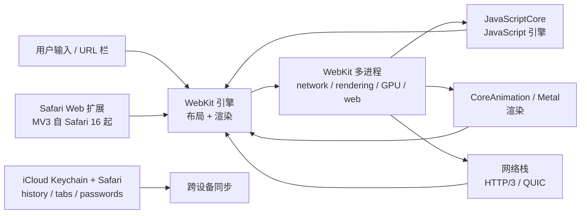

# Safari — Apple 原生网页浏览器，WebKit 与电池优先

**Safari** 是 Apple 的网页浏览器，基于 **WebKit** 渲染引擎。与
**macOS、iOS、iPadOS** 深度集成，Safari 自带对 Apple silicon 电池
优化、Apple Intelligence（端侧 AI）、Apple 隐私框架（智能跟踪防护、
指纹保护）的一流支持。

作为操作系统的一部分分发，Safari 在 Apple 平台外不可用。在 iOS /
iPadOS 上，**每个浏览器**底层都用 WebKit——Apple 政策——所以
Chrome for iOS、Firefox for iOS、Brave for iOS 等只在 UI、同步、
功能集上有差异，不在渲染引擎。

> **TL;DR。** Safari 是经典的"Apple 原生、电池优先"浏览器。随
> macOS / iOS / iPadOS 自带。WebKit 引擎；Apple Intelligence 端侧；
> ITP + 指纹保护；约 17% 桌面份额。

## Safari 为什么存在？

两个原因。

1. **Apple 生态集成。** Safari 与 OS 共享状态——Keychain、系统字体、
   Apple Pay、Apple Intelligence、iCloud 同步、Handoff（在 iPhone
   上开始，在 Mac 上完成）、Continuity Camera、系统分享面板、
   系统扩展。
2. **电池优先设计。** 在 Apple silicon 上，Safari 运行基于能耗剖析
   的优化，其他浏览器无法匹敌。Apple 发布的电池基准显示 Safari 流
   视频 16+ 小时，同样硬件上 Chrome 约 10 小时。

## 架构



主要组件：

- **WebKit** —— 布局 / 渲染引擎。开源；所有 iOS 浏览器都用。
- **JavaScriptCore（JSC）** —— Apple 的 JavaScript 引擎。最早是
  Nitro JIT，现在是分层 JIT，带字节码解释器、四层优化编译器、WebAssembly
  + WebGPU。
- **WebKit 多进程** —— network、rendering、GPU、web-content、
  web-extension 进程；按源站点隔离。
- **CoreAnimation / Metal** —— Apple 平台上的 GPU 渲染。
- **网络栈** —— 支持 HTTP/3、QUIC、TLS 1.3。

## 与相似工具的对比

| 工具 | 引擎 | 同步 | 隐私 | 最佳场景 |
| --- | --- | --- | --- | --- |
| **Safari** | WebKit | iCloud Keychain | 强（ITP、指纹） | Apple 用户、电池 |
| **[Chrome](https://www.google.com/chrome/)** | Blink | Google 账户 | Privacy Sandbox | 兼容性、生态 |
| **[Firefox](https://www.mozilla.org/firefox/)** | Gecko | Firefox Sync（Mozilla） | ETP、总 Cookie 保护 | 独立引擎、隐私 |
| **[Brave](https://brave.com/)** | Blink | Brave Sync | Chromium 系最强 | 隐私、广告拦截 |
| **[Orion](https://kagi.com/orion/)** | WebKit | iCloud | 强 | 想要 Chrome 风格的 Mac 用户 |

## 何时用 vs 何时不用

**用 Safari 的场景：**

- 你在 Apple 平台（macOS / iOS / iPadOS）并想要最深 OS 集成。
- 电池续航重要（在 Apple silicon 上 Safari 更凉爽、更持久）。
- 你想要 Apple Intelligence（端侧 AI）集成。
- 你想要 ITP 与指纹保护默认开启。
- 你想要用 iCloud Keychain 管理密码。

**不用 Safari 的场景：**

- 你依赖 Google 生态（Workspace、Drive、YouTube 上传）。
- 你想要 WebExtensions API（Firefox 更灵活；Chrome Web Store
  扩展更多）。
- 你想要引擎独立性——Safari 是唯一基于 WebKit 的主流浏览器；
  在 Apple 设备上你不能换引擎（iOS）或换到非 WebKit 选择
  （macOS）。
- 你想做跨平台开发（Safari 是最 Apple 特定的）。

## 如何安装

**Safari 随操作系统自带。**

| 平台 | 获取 Safari |
| --- | --- |
| **macOS** | 自带。Safari.app 在 `/Applications/`。 |
| **iOS** | 自带。不能卸载（系统要求）。 |
| **iPadOS** | 自带。不能卸载（系统要求）。 |

Safari 通过 OS 更新：

- macOS：`系统设置 → 软件更新`。
- iOS / iPadOS：`设置 → 通用 → 软件更新`。

Safari 大版本通常随 macOS / iOS 大版本发布。Safari 19 随
macOS 16 / iOS 19（2026 年 9 月）发布。

**macOS 系统要求说明：** Safari 19 要求 **macOS 13 Ventura 或更新**。
更老 macOS 留在 Safari 16（2022 年 9 月）。

## 配置

Safari 通过 `Safari → 设置`（macOS）或 `设置 → Safari`（iOS）配置。
高级 / 实验配置有隐藏的"开发"菜单：

```sh
# 在 Safari 菜单栏启用开发菜单（macOS）
defaults write com.apple.Safari IncludeDevelopMenu -bool true
```

### 常用 Safari 设置

| 设置 | 默认 | 用途 |
| --- | --- | --- |
| **阻止所有 Cookie** | 关 | 阻止所有 Cookie（极严）。 |
| **阻止跨站跟踪** | 开 | ITP 风格跨站 Cookie 阻止。 |
| **对跟踪器隐藏 IP 地址** | 开 | iCloud Private Relay 用于 Safari。 |
| **指纹保护** | 开 | 阻止指纹脚本。 |
| **阻止跨站跟踪** | 开 | ITP。 |
| **隐私报告** | n/a | 查看每周被阻止的内容。 |
| **显示完整 URL** | 关 | 显示 / 隐藏仅显示域。 |
| **后台打开链接** | 关 | 在后台打开新标签页。 |

### Safari Web 扩展

Safari 自带扩展 API——**Safari Web 扩展**——自 Safari 14
（macOS Big Sur）起。自 Safari 16（2022）起支持 Manifest V3。

```json
// Safari Web 扩展的 manifest.json（Manifest V3）
{
  "manifest_version": 3,
  "name": "My Extension",
  "version": "1.0",
  "description": "What it does",
  "permissions": ["activeTab"],
  "action": {
    "default_popup": "popup.html"
  },
  "content_scripts": [
    {
      "matches": ["<all_urls>"],
      "js": ["content.js"]
    }
  ]
}
```

## 隐私特性

| 特性 | 描述 | 默认？ |
| --- | --- | --- |
| **智能跟踪防护（ITP）** | 通过机器学习阻止跨站跟踪。 | ✅ |
| **对跟踪器隐藏 IP 地址** | iCloud Private Relay 用于 Safari 请求。 | ⚠️ 需要 iCloud+ |
| **指纹保护** | 阻止浏览器指纹脚本。 | ✅ |
| **阻止所有 Cookie** | 阻止每个 Cookie（极严）。 | ⚠️ 关（自选） |
| **阻止跨站跟踪** | ITP 跨站 Cookie 阻止。 | ✅ |
| **隐私报告** | 显示每周被阻止的内容。 | ✅ |
| **iCloud Keychain** | 密码通过 iCloud 端到端加密同步。 | ✅ |
| **隐藏邮件** | 用随机邮件别名注册（Hide My Email）。 | ⚠️ 需要 iCloud+ |
| **App 跟踪透明度**（iOS） | App 未经同意不能跟踪。 | ✅ |

## 系统要求

| 要求 | 细节 |
| --- | --- |
| **macOS** | Safari 19 要求 macOS 13 Ventura+。更老 macOS 用 Safari 16。 |
| **iOS / iPadOS** | iOS 13+ 用 Safari 13；最新 iOS 用最新 Safari。 |
| **Apple ID** | 用于 iCloud Keychain + iCloud+ Private Relay。 |
| **存储** | 约 100 MB 安装 + profile。 |

## 关键功能

| 功能 | 描述 |
| --- | --- |
| **阅读列表** | 保存文章以离线 / 后用。 |
| **阅读器视图** | 去除文章杂项。 |
| **标签页分组** | 把标签页组织到命名的组。 |
| **固定标签页** | 固定常用标签页。 |
| **画中画** | 把视频弹出成悬浮窗口。 |
| **翻译** | 内置翻译服务（云端）。 |
| **自动填充** | 通过 Keychain 系统级表单填充。 |
| **iCloud Keychain** | 密码跨 Apple 设备同步。 |
| **iCloud 标签页** | 从其他 Apple 设备看标签页。 |
| **Handoff** | 在 iPhone 开始浏览，在 Mac 完成。 |
| **Apple Pay** | 结算流程中原生 Apple Pay 集成。 |
| **Apple Intelligence** | 端侧 AI 用于摘要、改写、图像生成。 |
| **配置文件** | 分离工作 / 个人浏览配置文件。 |
| **Web Inspector** | Safari 的开发工具（右键 → 检查元素）。 |
| **WebExtensions** | 自 Safari 14 起的 Safari Web Extensions API。 |
| **WebGPU** | 自 Safari 19（2026 年 6 月）起默认启用。 |

## 典型场景

- **Apple 生态** —— Safari 与 OS 共享状态：Keychain、系统分享面板、
  系统扩展、Apple Pay、Handoff、Continuity。
- **Apple silicon 上的电池续航** —— Safari 在 MacBook / iPad 上是
  最持久的浏览器。
- **Apple Intelligence** —— 端侧 AI 功能（摘要、改写、图像生成）优先
  在 Safari 上发布。
- **隐私默认** —— ITP + 指纹保护默认开启。
- **iOS 唯一的浏览器** —— 每个 iOS 浏览器都基于 WebKit；Safari 是
  唯一能用 Apple 完整 WebKit + Apple 特定 API 的浏览器。

## 优 / 劣 / 结论

| 维度 | 结论 |
| --- | --- |
| **优** | Apple silicon 上电池续航最佳 |
| **优** | 最深 OS 集成（Keychain、Apple Pay、Handoff、Apple Intelligence） |
| **优** | 强隐私默认（ITP、指纹、隐藏 IP） |
| **优** | Apple Intelligence 端侧 AI |
| **优** | Safari 19 起默认启用 WebGPU |
| **劣** | 仅 macOS / iOS / iPadOS |
| **劣** | 扩展生态小于 Chrome Web Store |
| **劣** | 仅 WebKit——iOS 上不能换引擎 |
| **劣** | 一些网页应用（重 Google 服务）以 Chrome 为目标 |
| **结论** | **推荐**给重视电池 + 隐私 + OS 集成的 Apple 用户；**跳过**如果你在 Windows / Linux 或需要 Chrome 扩展生态。 |

## 需要记住的事

- **仅 macOS / iOS / iPadOS。** Windows / Linux 上没有。
- **每个 iOS 浏览器都是 WebKit。** Apple 政策。所以 Chrome for
  iOS、Firefox for iOS、Brave for iOS 只在 UI + 同步上有差异，渲染
  没有差异。
- **Safari 19 要求 macOS 13 Ventura。** 更老 macOS 留在 Safari 16。
- **Apple Intelligence** 要求 Apple silicon Mac（M1+）与较新 macOS /
  iOS。
- **隐藏我的邮件** 需要 iCloud+ 订阅。
- **iCloud Private Relay** 用于 Safari 需要 iCloud+。
- **开发菜单** 默认隐藏。用 defaults write 命令启用。

## 时间线

- **2003-01** —— Safari 1.0 —— 在 macOS X Panther 上首次公开发布。
- **2005** —— Windows 版 Safari（2012 年停止）。
- **2008-07** —— App Store 上线；WebKit 成为 iOS Safari 的引擎。
- **2010** —— Safari Extensions Gallery 上线。
- **2017** —— 智能跟踪防护（ITP）引入。
- **2019** —— Safari Web Extensions API 公布（WWDC）。
- **2020** —— Safari 14 发布 Web Extensions（Big Sur）。
- **2022** —— Safari 16 发布 Manifest V3 支持。
- **2024** —— Apple Intelligence 与 Safari 写作工具集成。
- **2026-06** —— 当前的 Safari 19 —— 默认启用 WebGPU；阅读器视图重新设计。

## 源码巡礼

Safari 基于 **WebKit**，开源项目：
[`WebKit/WebKit`](https://github.com/WebKit/WebKit)。主要组件：

- `Source/WebCore/` —— 布局 / 渲染引擎。
- `Source/JavaScriptCore/` —— JavaScript 引擎。
- `Source/WTF/` —— WebKit 模板框架（智能指针、容器）。
- `Source/WebKit/` —— 平台集成层。
- `Source/WebKitLegacy/` —— 旧版 WebKit 1 接口（基本弃用）。
- `LayoutTests/` —— WebKit 回归测试套件（非常全面）。

构建：

```bash
git clone https://github.com/WebKit/WebKit
cd WebKit
Tools/gtk/build-jsc                  # 构建 JavaScriptCore
Tools/Scripts/build-webkit --debug   # 构建 WebKit
```

注意：Safari 浏览器 UI 本身闭源。构建 WebKit 让你能跑非 Safari 的
基于 WebKit 的浏览器（如 Linux 上的 Epiphany / GNOME Web）。

## 下一步？

- **快速开始** —— Safari 已经在你的 Mac / iPhone 上。固定常用标签页。
- **阅读列表** —— 点击 book+ 图标保存以备后用。
- **标签页分组** —— 右键标签页，"添加到新组"。
- **iCloud 标签页** —— 从其他 Apple 设备看标签页。
- **开发菜单** —— 通过 defaults write 命令启用。

## 相关工具

- [Firefox](https://www.mozilla.org/firefox/) —— 独立引擎替代（也在 macOS / iOS）。
- [Chrome](https://www.google.com/chrome/) —— Google 生态 + 兼容性。
- [Brave](https://brave.com/) —— 带隐私默认的 Chromium。
- [Orion](https://kagi.com/orion/) —— Mac 上 Chrome 风格的浏览器。
- [GNOME Web (Epiphany)](https://apps.gnome.org/Epiphany/) —— Linux 上基于 WebKit 的浏览器。

## 源码与官方资源

- **官网：** <https://www.apple.com/safari/>
- **源码（WebKit）：** <https://github.com/WebKit/WebKit>
- **Safari 用户指南：** <https://support.apple.com/guide/safari/>
- **Safari Web 扩展文档：**
  <https://developer.apple.com/documentation/safariservices/safari_web_extensions>
- **Apple 开发者（Safari）：** <https://developer.apple.com/safari/>
- **Apple 安全（Safari）：** <https://support.apple.com/guide/security/>