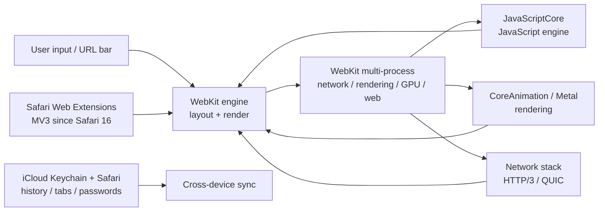

# Safari — Apple's Native Web Browser with WebKit and Battery-First Design

**Safari** is Apple's web browser, built on the **WebKit**
rendering engine. Tightly integrated with **macOS, iOS, and
iPadOS**, Safari ships first-class support for Apple silicon
battery optimization, Apple Intelligence (on-device AI), and
Apple's privacy framework (Intelligent Tracking Prevention,
fingerprint protection).

Distributed as part of the operating system, Safari is not
available outside Apple's platforms. On iOS / iPadOS, **every
browser** uses WebKit under the hood — Apple's policy — so
Chrome for iOS, Firefox for iOS, Brave for iOS, etc. all
differ only in UI, sync, and feature set, not in rendering
engine.

> **TL;DR.** Safari is the canonical "Apple-native, battery-
> first" browser. Bundled with macOS / iOS / iPadOS. WebKit
> engine; Apple Intelligence on-device; ITP + fingerprint
> protection; ~17% desktop share.

## Why does Safari exist?

Two reasons.

1. **Apple ecosystem integration.** Safari shares state with
   the OS — Keychain, system fonts, Apple Pay, Apple
   Intelligence, iCloud sync, Handoff (start on iPhone,
   finish on Mac), Continuity Camera, system share sheet,
   system extensions.
2. **Battery-first design.** On Apple silicon, Safari runs
   energy-profiling-guided optimizations that other browsers
   can't match. Apple publishes battery benchmarks showing
   Safari streaming 16+ hours of video vs ~10 hours for
   Chrome on the same hardware.

## Architecture



Major components:

- **WebKit** — the layout / rendering engine. Open-source;
  used by all iOS browsers.
- **JavaScriptCore (JSC)** — Apple's JavaScript engine.
  Originally the Nitro JIT, now Tiered JIT with bytecode
  interpreter, four-tier optimizing compiler, WebAssembly +
  WebGPU.
- **WebKit multi-process** — network, rendering, GPU,
  web-content, web-extension processes; site isolation per
  origin.
- **CoreAnimation / Metal** — GPU rendering on Apple
  platforms.
- **Network stack** — supports HTTP/3, QUIC, TLS 1.3.

## How does it differ from similar tools?

| Tool | Engine | Sync | Privacy | Best for |
| --- | --- | --- | --- | --- |
| **Safari** | WebKit | iCloud Keychain | Strong (ITP, fingerprint) | Apple users, battery |
| **[Chrome](https://www.google.com/chrome/)** | Blink | Google account | Privacy Sandbox | Compatibility, ecosystem |
| **[Firefox](https://www.mozilla.org/firefox/)** | Gecko | Firefox Sync (Mozilla) | ETP, Total Cookie Protection | Independent engine, privacy |
| **[Brave](https://brave.com/)** | Blink | Brave Sync | Strongest in Chromium | Privacy, ad blocking |
| **[Orion](https://kagi.com/orion/)** | WebKit | iCloud | Strong | Mac users who want Chrome-like features |

## When to use vs when NOT

**Use Safari when:**

- You're on Apple platforms (macOS / iOS / iPadOS) and want
  the deepest OS integration.
- Battery life matters (Safari runs cooler / longer on Apple
  silicon).
- You want Apple Intelligence (on-device AI) integration.
- You want ITP and fingerprint protection on by default.
- You want to use iCloud Keychain for passwords.

**Don't use Safari when:**

- You depend on Google ecosystem (Workspace, Drive, YouTube
  upload).
- You want WebExtensions API (Firefox is more flexible; Chrome
  Web Store has more extensions).
- You want engine independence — Safari is the only WebKit-
  based major browser; you can't switch engines on Apple
  devices (iOS) or switch to a non-WebKit option (macOS).
- You want to develop cross-platform (Safari is the most
  Apple-specific).

## How to install

**Safari is bundled with the operating system.**

| Platform | How to get Safari |
| --- | --- |
| **macOS** | Bundled. Safari.app is in `/Applications/`. |
| **iOS** | Bundled. Cannot be removed (system requirement). |
| **iPadOS** | Bundled. Cannot be removed (system requirement). |

Safari is updated via the OS:

- macOS: `System Settings → Software Update`.
- iOS / iPadOS: `Settings → General → Software Update`.

Major Safari releases typically ship with major macOS / iOS
releases. Safari 19 ships with macOS 16 / iOS 19 (Sep 2026).

**Note on macOS system requirements:** Safari 19 requires
**macOS 13 Ventura or later**. Older macOS versions stay on
Safari 16 (Sep 2022).

## Configuration

Safari is configured through `Safari → Settings` (macOS) or
`Settings → Safari` (iOS). For advanced / experimental
settings, there's a hidden Develop menu:

```sh
# Enable Develop menu in Safari menu bar (macOS)
defaults write com.apple.Safari IncludeDevelopMenu -bool true
```

### Useful Safari settings

| Setting | Default | Purpose |
| --- | --- | --- |
| **Block all cookies** | Off | Block all cookies (very strict). |
| **Block cross-site tracking** | On | ITP-style cross-site cookie blocking. |
| **Hide IP address from trackers** | On | iCloud Private Relay for Safari. |
| **Fingerprinting protection** | On | Block fingerprint scripts. |
| **Prevent cross-site tracking** | On | ITP. |
| **Privacy Report** | n/a | View what's been blocked. |
| **Show full URL** | Off | Show / hide domain only. |
| **Open links in background** | Off | Open new tabs in background. |

### Safari Web Extensions

Safari ships its own extension API — **Safari Web Extensions**
— since Safari 14 (macOS Big Sur). Supports Manifest V3 since
Safari 16 (2022).

```json
// manifest.json for a Safari Web Extension (Manifest V3)
{
  "manifest_version": 3,
  "name": "My Extension",
  "version": "1.0",
  "description": "What it does",
  "permissions": ["activeTab"],
  "action": {
    "default_popup": "popup.html"
  },
  "content_scripts": [
    {
      "matches": ["<all_urls>"],
      "js": ["content.js"]
    }
  ]
}
```

## Privacy features

| Feature | Description | Default? |
| --- | --- | --- |
| **Intelligent Tracking Prevention (ITP)** | Block cross-site tracking via machine learning. | ✅ |
| **Hide IP address from trackers** | iCloud Private Relay for Safari requests. | ⚠️ Requires iCloud+ |
| **Fingerprint protection** | Block browser-fingerprint scripts. | ✅ |
| **Block all cookies** | Block every cookie (very strict). | ⚠️ Off (opt-in) |
| **Block cross-site tracking** | ITP cross-site cookie blocking. | ✅ |
| **Privacy Report** | Show what's been blocked per week. | ✅ |
| **iCloud Keychain** | Passwords sync end-to-end encrypted via iCloud. | ✅ |
| **Hide email** | Sign up with random email aliases (Hide My Email). | ⚠️ Requires iCloud+ |
| **App Tracking Transparency** (iOS) | Apps can't track without consent. | ✅ |

## System requirements

| Requirement | Detail |
| --- | --- |
| **macOS** | Safari 19 requires macOS 13 Ventura+. Safari 16 on older macOS. |
| **iOS / iPadOS** | iOS 13+ for Safari 13; latest iOS for latest Safari. |
| **Apple ID** | For iCloud Keychain + iCloud+ Private Relay. |
| **Storage** | ~100 MB install + profile. |

## Key features

| Feature | Description |
| --- | --- |
| **Reading List** | Save articles for offline / later. |
| **Reading View** | Strip clutter from articles. |
| **Tab Groups** | Organize tabs into named groups. |
| **Pinned Tabs** | Pin frequently-used tabs. |
| **Picture-in-Picture** | Pop video out into floating window. |
| **Translate** | Built-in translation service (cloud). |
| **AutoFill** | System-wide form filling via Keychain. |
| **iCloud Keychain** | Passwords sync across Apple devices. |
| **iCloud Tabs** | See tabs from your other Apple devices. |
| **Handoff** | Start browsing on iPhone, finish on Mac. |
| **Apple Pay** | Native Apple Pay integration in checkout flows. |
| **Apple Intelligence** | On-device AI for summarize, rewrite, image generation. |
| **Profiles** | Separate browsing profiles for work / personal. |
| **Web Inspector** | Safari's developer tools (right-click → Inspect Element). |
| **WebExtensions** | Safari Web Extensions API since Safari 14. |
| **WebGPU** | Default since Safari 19 (Jun 2026). |

## Typical use cases

- **Apple ecosystem** — Safari shares state with the OS:
  Keychain, system share sheet, system extensions, Apple
  Pay, Handoff, Continuity.
- **Battery life on Apple silicon** — Safari is the longest-
  lasting browser on MacBook / iPad.
- **Apple Intelligence** — on-device AI features (summarize,
  rewrite, image generation) ship first to Safari.
- **Privacy defaults** — ITP + fingerprint protection on by
  default.
- **iOS-only browsers** — every iOS browser is WebKit-based;
  Safari is the only one with Apple's full WebKit + Apple-
  specific APIs.

## Pro / Con / Verdict

| Dimension | Verdict |
| --- | --- |
| **Pro** | Best battery life on Apple silicon |
| **Pro** | Deepest OS integration (Keychain, Apple Pay, Handoff, Apple Intelligence) |
| **Pro** | Strong privacy defaults (ITP, fingerprint, Hide IP) |
| **Pro** | Apple Intelligence on-device AI |
| **Pro** | WebGPU enabled by default in Safari 19 |
| **Con** | macOS / iOS / iPadOS only |
| **Con** | Smaller extension ecosystem than Chrome Web Store |
| **Con** | WebKit-only — can't switch engines on iOS |
| **Con** | Some web apps (heavy Google services) target Chrome |
| **Verdict** | **Recommended** for Apple users who value battery + privacy + OS integration; **skip** if you're on Windows / Linux or need the Chrome extension ecosystem. |

## Things to keep in mind

- **macOS / iOS / iPadOS only.** Not available on Windows or
  Linux.
- **Every iOS browser is WebKit.** Apple policy. So Chrome
  for iOS, Firefox for iOS, Brave for iOS differ only in UI
  + sync, not in rendering.
- **Safari 19 requires macOS 13 Ventura.** Older macOS stays
  on Safari 16.
- **Apple Intelligence** requires an Apple silicon Mac (M1+)
  and a recent macOS / iOS.
- **Hide My Email** requires an iCloud+ subscription.
- **iCloud Private Relay** for Safari requires iCloud+.
- **Develop menu** is hidden by default. Use the defaults
  write command to enable.

## Timeline

- **2003-01** — Safari 1.0 — first public release on macOS
  X Panther.
- **2005** — Safari for Windows (discontinued 2012).
- **2008-07** — App Store launches; WebKit becomes the
  engine for iOS Safari.
- **2010** — Safari Extensions Gallery opens.
- **2017** — Intelligent Tracking Prevention (ITP) introduced.
- **2019** — Safari Web Extensions API announced (WWDC).
- **2020** — Safari 14 ships Web Extensions (Big Sur).
- **2022** — Safari 16 ships Manifest V3 support.
- **2024** — Apple Intelligence integrated with Safari
  writing tools.
- **2026-06** — current Safari 19 — WebGPU enabled by
  default; redesigned reader view.

## Source-code tour

Safari is built on **WebKit**, the open-source project:
[`WebKit/WebKit`](https://github.com/WebKit/WebKit). Major
components:

- `Source/WebCore/` — the layout / rendering engine.
- `Source/JavaScriptCore/` — the JavaScript engine.
- `Source/WTF/` — WebKit Template Framework (smart pointers,
  containers).
- `Source/WebKit/` — the platform integration layer.
- `Source/WebKitLegacy/` — the legacy WebKit 1 interface
  (mostly deprecated).
- `LayoutTests/` — the WebKit regression test suite (very
  comprehensive).

Build:

```bash
git clone https://github.com/WebKit/WebKit
cd WebKit
Tools/gtk/build-jsc                  # build JavaScriptCore
Tools/Scripts/build-webkit --debug   # build WebKit
```

Note: building the Safari browser UI itself is closed-source.
Building WebKit lets you run a non-Safari WebKit-based
browser (e.g. Epiphany / GNOME Web on Linux).

## What next?

- **Quick start** — Safari is already on your Mac / iPhone.
  Pin frequently-used tabs.
- **Reading List** — click the book+ icon to save for later.
- **Tab Groups** — right-click a tab, "Add tab to new group".
- **iCloud Tabs** — see tabs from your other Apple devices.
- **Develop menu** — enable via the defaults write command.

## Related Tools

- [Firefox](https://www.mozilla.org/firefox/) — independent
  engine alternative (also on macOS / iOS).
- [Chrome](https://www.google.com/chrome/) — Google ecosystem
  + compatibility.
- [Brave](https://brave.com/) — Chromium with privacy defaults.
- [Orion](https://kagi.com/orion/) — Mac browser with
  Chrome-like features.
- [GNOME Web (Epiphany)](https://apps.gnome.org/Epiphany/) —
  Linux WebKit-based browser.

## Source & Official Resources

- **Website:** <https://www.apple.com/safari/>
- **Source (WebKit):** <https://github.com/WebKit/WebKit>
- **Safari User Guide:**
  <https://support.apple.com/guide/safari/>
- **Safari Web Extensions docs:**
  <https://developer.apple.com/documentation/safariservices/safari_web_extensions>
- **Apple Developer (Safari):**
  <https://developer.apple.com/safari/>
- **Apple Security (Safari):**
  <https://support.apple.com/guide/security/>